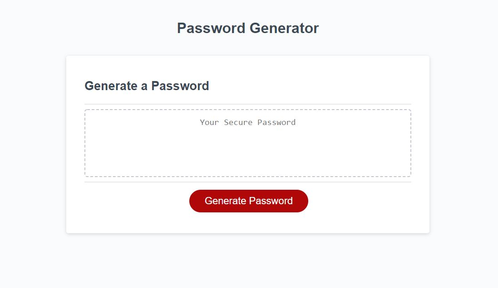

Password Generator
​

Description - 
​A website to create a randomly generated password.  The site will ask the user how long they want their password and validate that it is between 8 and 128 characters (inclusive).  The site will also ask the user if they want uppercase letters, lowercase letters, numbers or special characters, and will validate that they have chosen at least one option.
​

Usage - 
​The website is interactive, but there is nothing to install. ​The address for the website is https://sandymccabe.github.io/Password/

Credits - 
​The front end interface was provided by Trilogy Education.  All javascript code written and edited by Sandy McCabe​​

License - 
​There are no licenses on this work at this time. Please check back for future updates.​
